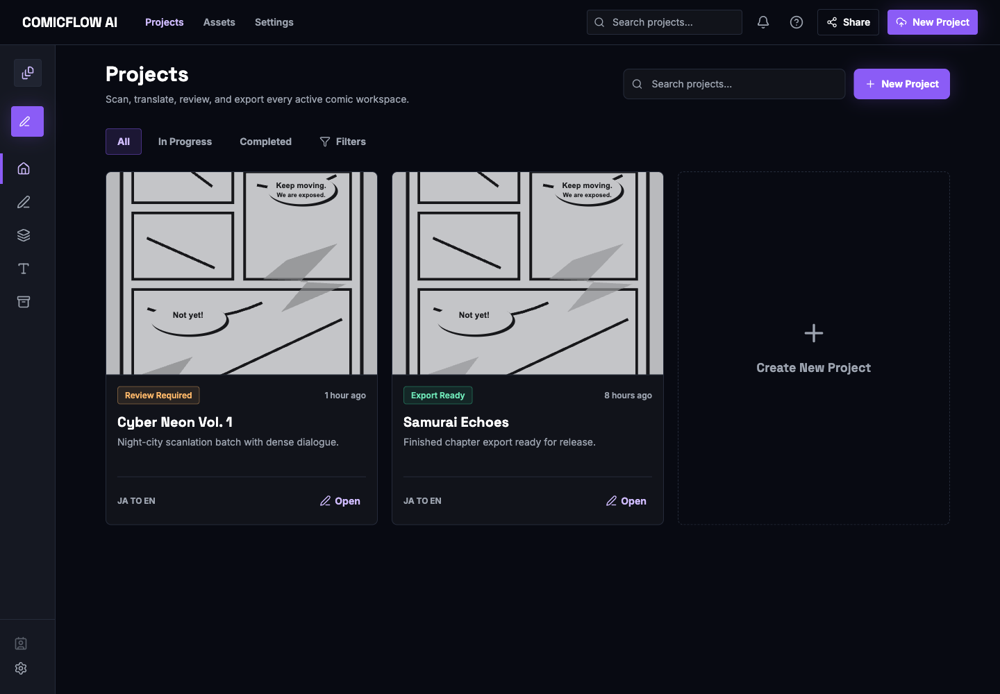

# Getting Started

This page gets you from a fresh checkout to an open browser. Choose the path that matches what you need.

## Option 1: Full Local Prototype

Use this for the real app flow with the backend, frontend, local storage, SQLite, Tesseract OCR, and OPUS-MT translation.

### Prerequisites

- Node.js 24 LTS and npm
- Conda
- Python 3.11 in the `imagetranslator` conda environment
- Tesseract and language data if you use the default OCR provider
- OPUS-MT model folders prepared under `backend/models/opus-mt/`

### One-Time Setup

```bash
cd backend
conda create -n imagetranslator python=3.11 -y
conda run -n imagetranslator python -m pip install -e ".[dev,ocr]"
conda run -n imagetranslator python -m pip install -e ".[dev,local-ml]"
./scripts/setup_opus_mt_models.sh
cd ..
```

```bash
cd frontend
npm install
cd ..
```

On macOS host runs, install Tesseract if it is not already available:

```bash
brew install tesseract tesseract-lang
```

### Start the App

From the repository root:

```bash
./start-local-prototype.sh
```

Open:

- Frontend: `http://127.0.0.1:5173`
- Backend health: `http://127.0.0.1:8000/api/v1/health`
- Backend API docs: `http://127.0.0.1:8000/docs`

Stop both servers with `Ctrl-C`.

## Option 2: Docker

Use Docker when you want Docker-managed services and PostgreSQL.

```bash
cd backend
./scripts/setup_opus_mt_models.sh
cd ..
docker compose up --build
```

Open:

- Frontend: `http://localhost:5173`
- API health: `http://localhost:8000/api/v1/health`
- API docs: `http://localhost:8000/docs`

Stop:

```bash
docker compose down
```

## Option 3: UI-Only Mock Mode

Use this for screenshots, quick UI exploration, or frontend-only development. It does not call the backend and does not run real OCR or translation.

```bash
cd frontend
npm install
VITE_API_MODE=mock npm run dev
```

Open the Vite URL printed in the terminal, usually:

```text
http://127.0.0.1:5173/
```

## First Screen



*The dashboard lists active and export-ready projects. Mock mode includes safe sample projects for demos and tests.*

## What to Upload

In HTTP mode, uploads support:

- PNG
- JPG/JPEG
- WEBP
- ZIP archives containing image pages

PDF appears in the frontend mock upload UI for demo coverage, but real backend HTTP uploads currently support images and ZIP archives.
