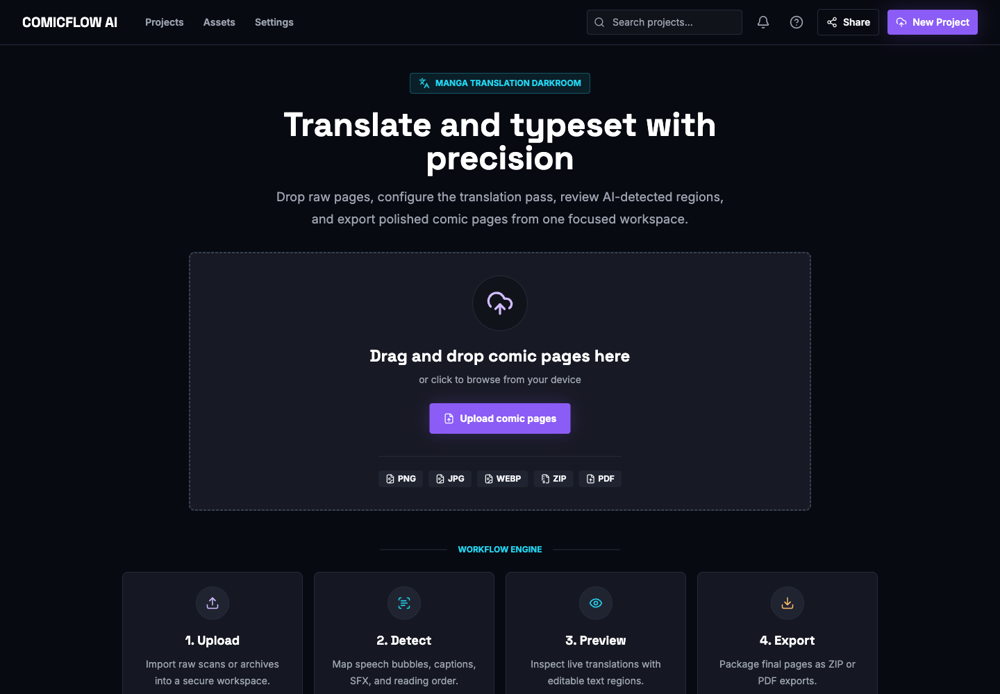

# ImageTranslator

ImageTranslator is a prototype local workflow for translating manga, manhwa, comics, and scanned image pages. It lets you upload pages, run OCR and translation, review detected text regions, correct the result manually, render translated pages, and export the final package.

The app is most useful when you have image pages or a ZIP of pages and want one workspace for:

- detecting speech bubbles, captions, and sound effects
- translating detected text into English
- reviewing low-confidence OCR or translation output
- editing text and render style before export
- downloading translated pages as ZIP, image ZIP, or PDF



*The first screen accepts comic pages and links into the end-to-end workflow.*

## Current Scope

ImageTranslator is prototype-first local software. The current app does not require login in local HTTP mode. Workflow API routes use a shared public workspace user, and jobs run eagerly by default so local processing is easy to inspect.

The default local providers are:

- OCR: `tesseract`
- Translation: `opus_mt`
- Rendering: `pillow`

No external provider API keys are required for the default local run, but OPUS-MT model folders must be prepared before real translation processing works.

!!! note "Screenshots"
    The screenshots in this documentation were captured from the current frontend using `VITE_API_MODE=mock` with safe sample data. Real local runs use the same screens, but processing output depends on your installed OCR/translation providers and uploaded pages.

## Start Here

- Try the deployed prototype: <http://158.101.11.4:5173>
- Latest release: [v0.0.2 release notes](release-notes.md#v002-editor-workflow-and-deployment-automation-may-28-2026).
- New user: follow [Getting Started](getting-started.md), then [Using the App](using-the-app.md).
- Local developer: use [Local Setup](local-setup.md) or [Docker](docker.md).
- Coding agent: read [Architecture](architecture.md), [Backend API](backend-api.md), [Frontend](frontend.md), and [Contributing](contributing.md).

## Repository Map

```text
backend/    FastAPI API, SQLAlchemy models, migrations, providers, services, tests
frontend/   Vite React app, routed screens, API adapters, tests
docs/       MkDocs documentation site and screenshots
e2e/        Root-level full-stack browser smoke scripts
testing/    Generated local evidence, ignored by git
```

## Published Site

Deployed app:

<http://158.101.11.4:5173>

Published documentation:

<https://syedbaqarabbas.github.io/ImageTranslator/>
