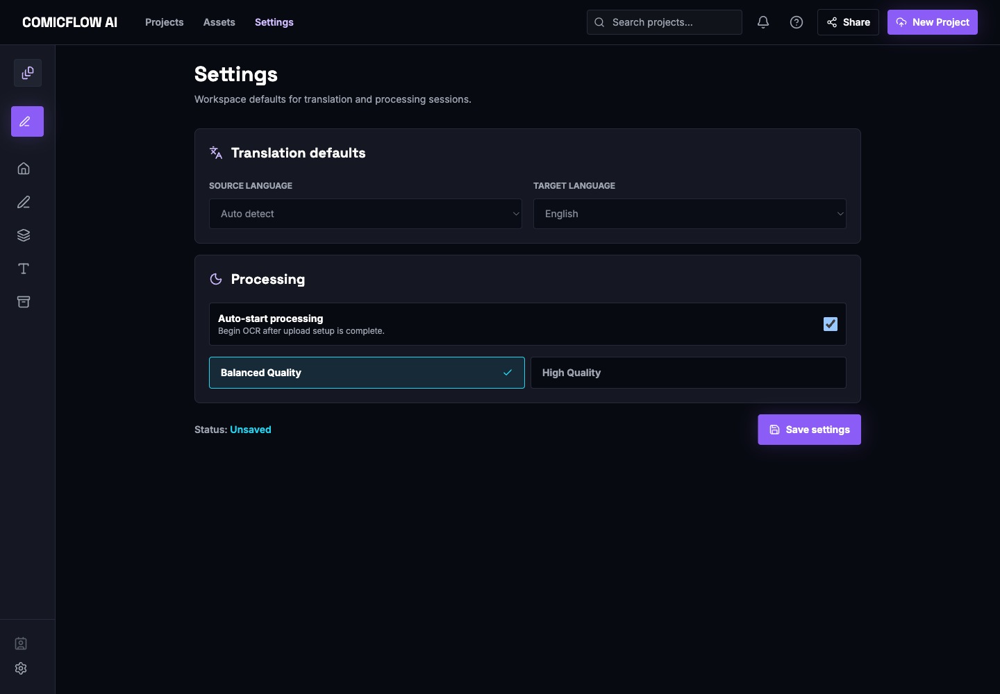

# Providers

ImageTranslator uses provider interfaces for OCR, translation, and rendering. Provider selection is environment-variable based.

## Current Defaults

| Provider type | Default | Notes |
| --- | --- | --- |
| OCR | `OCR_PROVIDER=tesseract` | Requires native Tesseract and language data |
| Translation | `TRANSLATION_PROVIDER=opus_mt` | Requires local CTranslate2 OPUS-MT model folders |
| Rendering | `RENDER_ENGINE=pillow` | Implemented renderer |

No external provider API keys are required for the default local workflow.

## OCR Providers

### `mock`

Use for deterministic tests and demos:

```bash
OCR_PROVIDER=mock
```

The mock OCR provider creates one synthetic text region near the top of each image with sample detected text.

### `tesseract`

Default local provider:

```bash
OCR_PROVIDER=tesseract
```

Tesseract requires the native binary and language data. For macOS host runs:

```bash
brew install tesseract tesseract-lang
```

Useful variables:

```text
TESSERACT_CMD
TESSERACT_DATA_PATH
TESSERACT_DEFAULT_LANGUAGE
TESSERACT_AUTO_LANGUAGE
TESSERACT_PSM
TESSERACT_OEM
TESSERACT_KOREAN_TEXT_DETECTION
```

Prefer explicit source languages such as `kor` or `jpn` for speed and consistency.
Explicit Korean projects use `TESSERACT_KOREAN_TEXT_DETECTION=true` by default:
a lightweight comic text-block detector selects bounded crops before Tesseract
recognition. The provider falls back to full-page recognition when bounded
detection does not return usable regions.

Run the safe generated localization benchmark from `backend/`:

```bash
conda run -n imagetranslator python scripts/benchmark_korean_region_detection.py
```

Actual Korean manhwa comparisons use a local-only fixture manifest so private or
copyrighted pages are not committed. See `backend/tests/manual/README.md`.

### `easyocr`

Optional OCR provider:

```bash
OCR_PROVIDER=easyocr
```

EasyOCR can download model files under `~/.EasyOCR` on first actual OCR use. Use it only when the optional OCR dependencies are installed and you expect that local model cache behavior.

## Translation Providers

### `mock`

Use for deterministic tests and demos:

```bash
TRANSLATION_PROVIDER=mock
```

The mock translation provider returns predictable text using the target language and source string.

### `opus_mt`

Default local provider:

```bash
TRANSLATION_PROVIDER=opus_mt
```

OPUS-MT expects local model folders. Prepare them with:

```bash
cd backend
./scripts/setup_opus_mt_models.sh
cd ..
```

Default model roots:

| Run mode | Model root |
| --- | --- |
| Host script | `<repo>/backend/models/opus-mt` |
| Docker Compose | `/app/models/opus-mt` |

Common variables:

```text
OPUS_MT_MODEL_ROOT
OPUS_MT_KO_EN_MODEL_PATH
OPUS_MT_JA_EN_MODEL_PATH
OPUS_MT_DEFAULT_SOURCE_LANGUAGE
OPUS_MT_COMPUTE_TYPE
OPUS_MT_BEAM_SIZE
OPUS_MT_INTRA_THREADS
OPUS_MT_INTER_THREADS
OPUS_MT_MAX_BATCH_SIZE
```

## Rendering

The implemented renderer is:

```bash
RENDER_ENGINE=pillow
```

The Pillow renderer cleans detected boxes, wraps translated text, fits font size, and renders replacement, overlay, bilingual, side-panel, or subtitle output.

## Provider Configuration UI

The current UI does not expose a full provider credential/configuration editor. The Settings page shows runtime language defaults and local processing controls, but provider names, model paths, and storage credentials are configured through environment variables.



*Settings reflects runtime language defaults. Provider selection lives in local environment configuration.*
