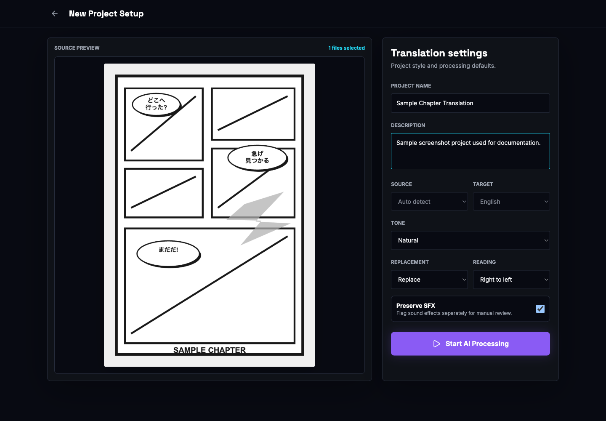
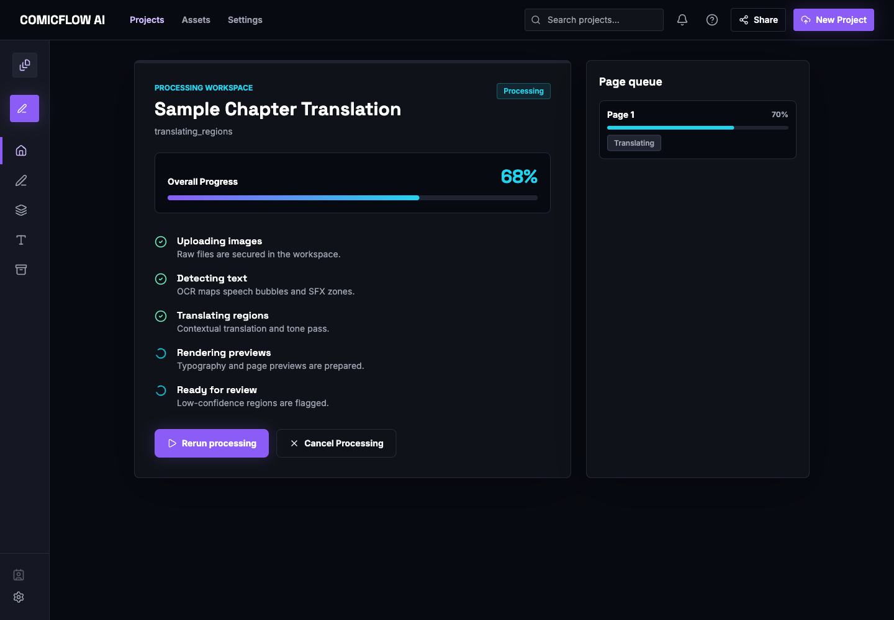
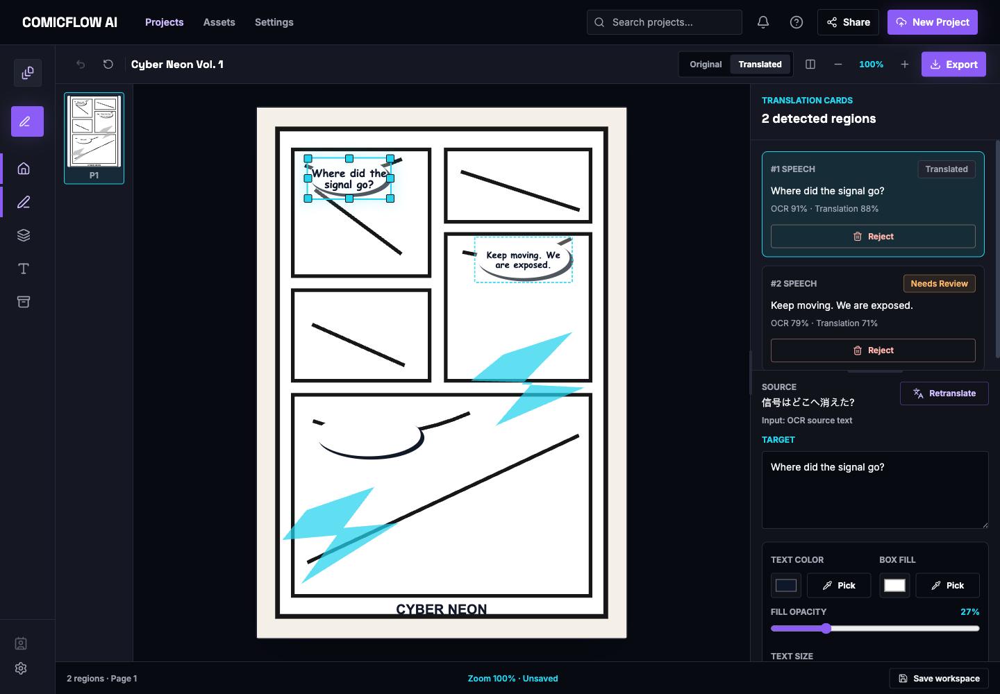
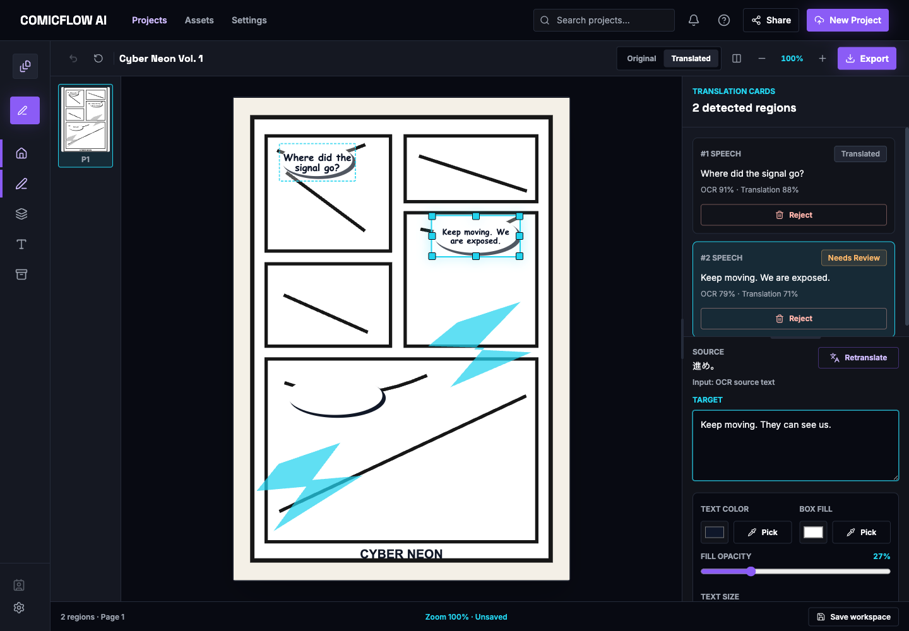
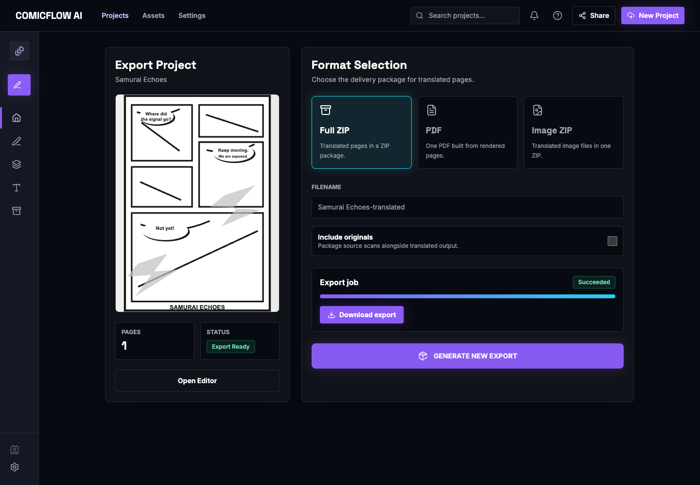

# Using the App

This guide follows the normal user path from opening the app to downloading a translated result.

## 1. Open the App

Start the app with one of the setup paths in [Getting Started](getting-started.md), then open the frontend URL in your browser.

*The home screen is the fastest way to start a new translation project.*

## 2. Upload or Import Pages

Use the upload box to select one or more images, or a ZIP archive of image pages. You can drag files onto the dropzone or click the upload area to browse from your device.

After selecting files, the app opens the project setup screen. Review the preview and fill in the project details.

*Project setup stores the project name, description, tone, replacement mode, reading direction, and SFX handling preference.*

Important notes:

- Source and target language controls are locked to the runtime provider configuration.
- In the default local setup, source is auto-detected and target is English.
- `Preserve SFX` flags sound effects separately so you can review them manually.
- Click `Start AI Processing` to create the project, upload pages, and start processing.

## 3. Run OCR and Translation

The processing screen tracks the current job stage and page queue.

*Processing uploads pages, detects text, translates regions, renders previews, and prepares review state.*

The frontend starts processing through the API and polls job state. In the default backend, Celery runs eagerly, so processing happens inline in the local API process.

If processing fails, stay on this screen and read the failure message. Common causes are missing OPUS-MT models, missing Tesseract language data, unsupported upload files, or trying to process a project with no pages.

## 4. Review Flagged Regions

When processing reaches review state, open the review queue. Regions are flagged when OCR or translation confidence is low, when translation text is missing, or when a region status requires attention.

On the review screen you can:

- approve a region if the text is good
- open the editor for detailed changes
- go to export once the project is ready

Approving a region persists the current translated text and locks that region from further editing.

## 5. Manually Edit or Correct Text

Open the editor from the review screen, dashboard, or sidebar. Select a region card to inspect OCR source text, target text, confidence, and render controls.

*The editor shows the page canvas, detected region boxes, page thumbnails, and translation cards.*

For a manual correction:

1. Select the region on the page or in `Translation Cards`.
2. Edit the `Target` text.
3. Adjust text color, box fill, fill opacity, or text size if needed.
4. Click `Save` to persist the draft and rerender.
5. Click `Approve` when the region is ready for export.

*The target textarea is where you correct OCR or translation mistakes before saving or approving.*

The editor also supports:

- `Retranslate`, which asks the backend translation provider to translate the OCR source text again
- region reject/delete
- region drag and resize on the canvas
- original/translated view switching
- compare split view
- zoom controls

## 6. Export or Download Results

Open the export page when translated pages are ready.

*The export screen can create a full ZIP, PDF, or image ZIP. Successful exports expose a download link.*

Export options:

- `Full ZIP`: translated pages in one package
- `PDF`: one PDF built from rendered pages
- `Image ZIP`: translated image files in one package

For ZIP formats, `Include originals` packages source scans alongside the translated output. PDF exports always use rendered pages only.

If the app says no rendered pages are available, return to processing or the editor and make sure pages have completed processing/rerendering.

## 7. Settings and Provider Configuration

The current Settings screen shows runtime language defaults and local workspace processing controls. Full provider configuration is environment-variable based rather than edited in the UI.

*Language defaults are locked to the backend runtime configuration. Provider credentials and model paths are configured outside the UI.*

Use [Providers](providers.md) for OCR/translation provider details and [Local Setup](local-setup.md) for environment variables.

## Common Mistakes

- Uploading PDF in HTTP mode. Use image files or ZIP archives for real backend processing.
- Starting the default providers before OPUS-MT models exist under `backend/models/opus-mt/`.
- Running host mode without Tesseract or language data installed.
- Expecting Settings to change provider credentials. Provider settings currently come from environment variables.
- Exporting before any rendered pages exist.
